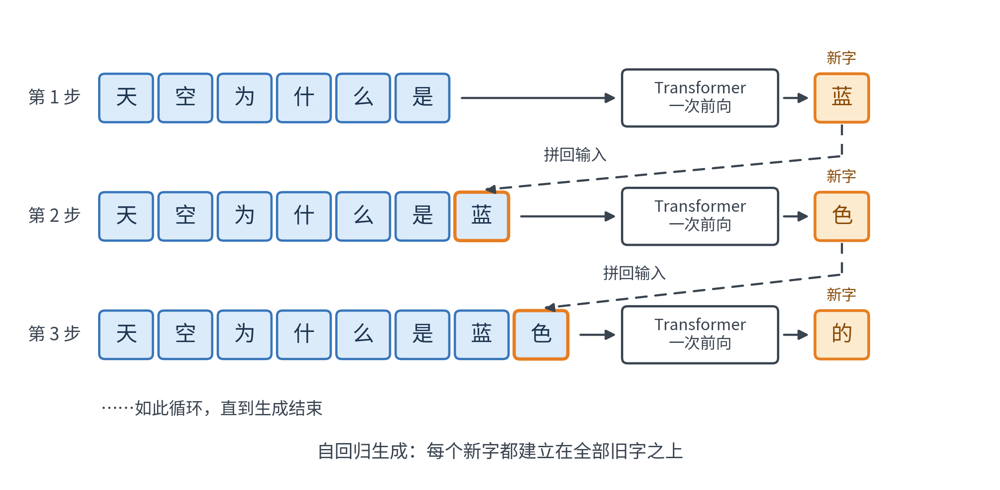
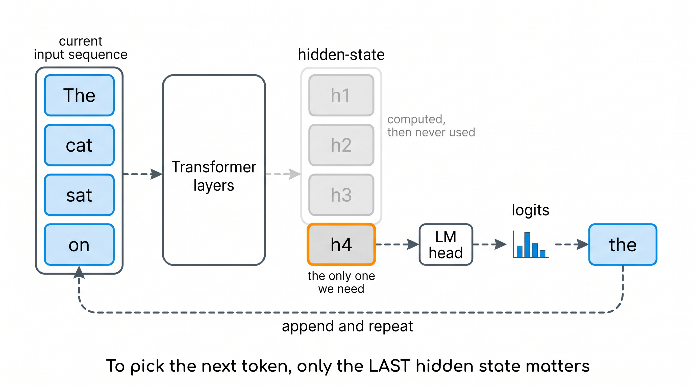
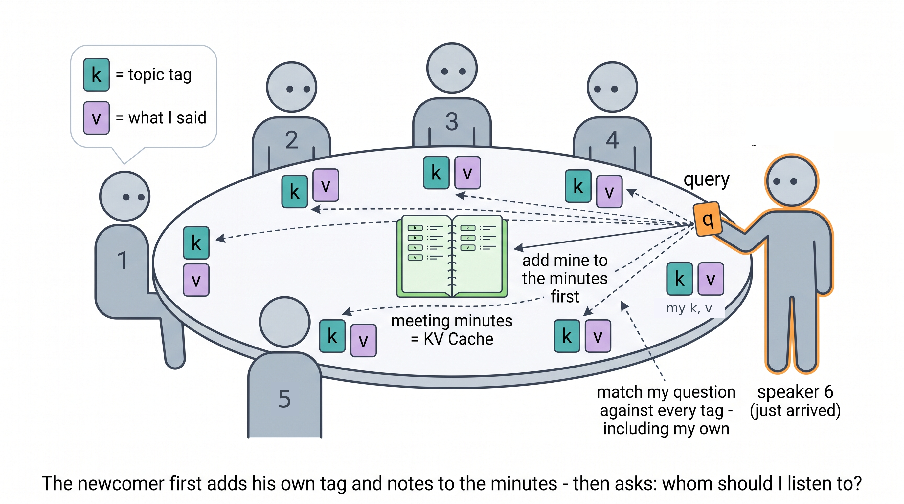
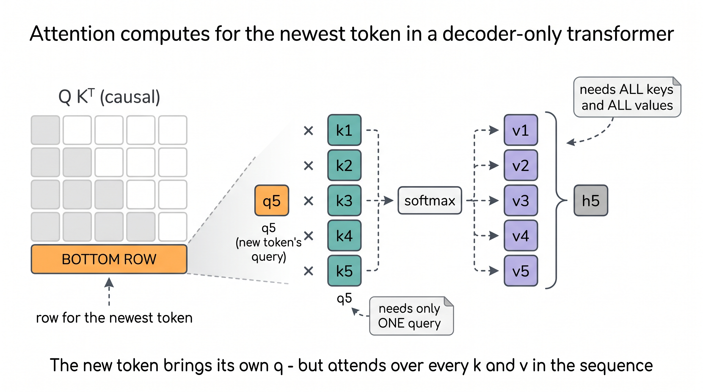
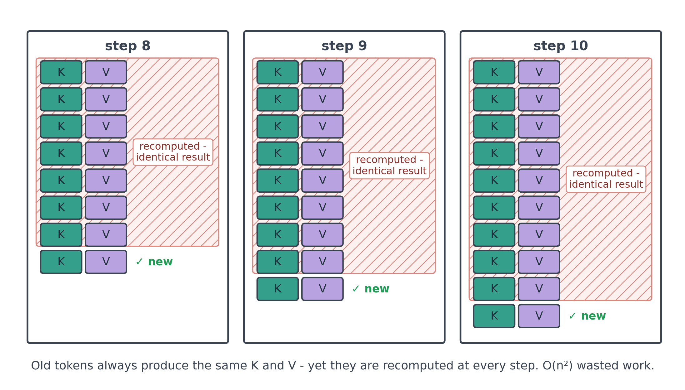
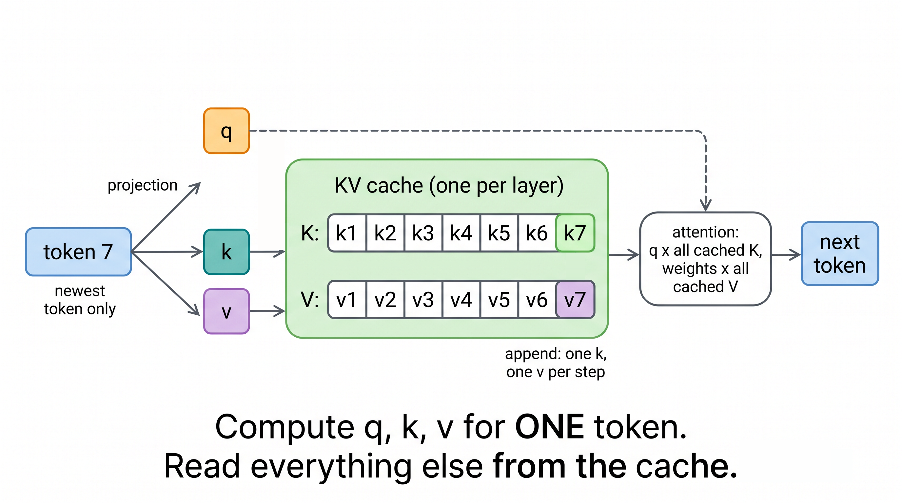
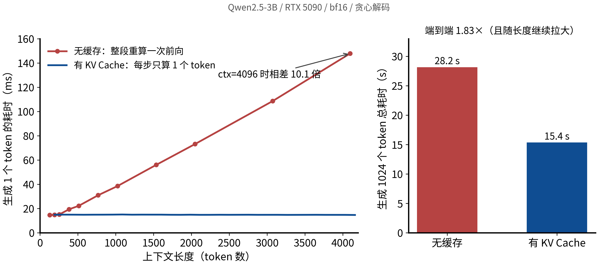
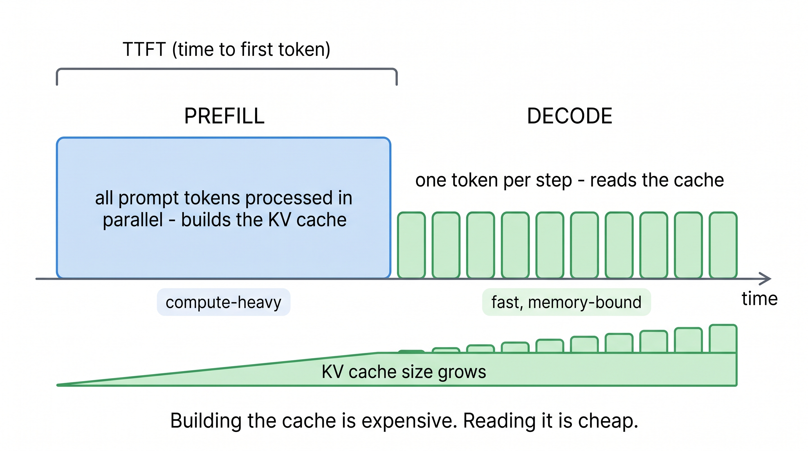
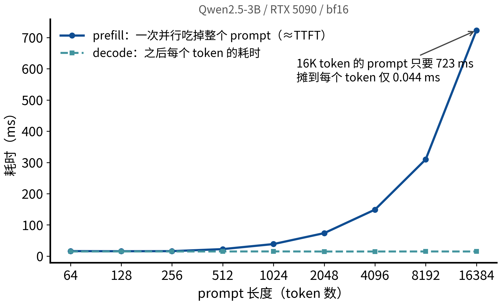
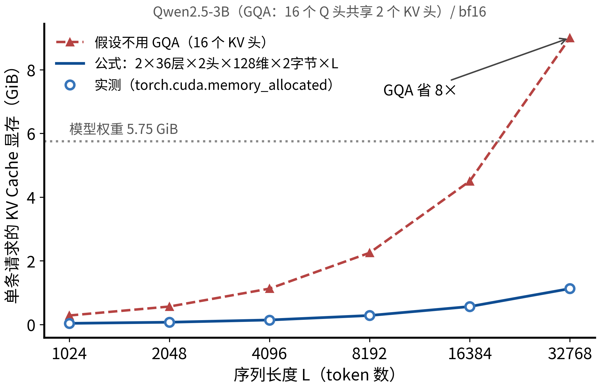

# LLM 中的 KV Cache

你大概注意到过：不管是 ChatGPT 还是 Claude，第一个字总要等一下，后面的字却哗哗往外冒。网络和排队当然会掺进一些延迟，但这个“首字慢、后续快”的节奏本身，是 LLM 推理架构里最基础的设计之一 **KV Cache** 留下的指纹。

先给你一个 30 秒版本，后面整篇文章都是在展开它：

> LLM 每写一个新字，都要“回头看”前面的所有字。而前面每个字能提供给后人看的信息，从它生成那一刻起就**永远不会再变**。既然不变，算一遍存下来就好，别每次都重算——这就是 KV Cache。它把推理从“每一步都从头再来”变成“每一步只算一个新字”，代价是这份“存档”要占显存，而且占得不少。

就这么一件事。但顺着它往下挖，你会挖出一整条现代推理优化的生态链：为什么第一个字慢、为什么长上下文贵、GQA/PagedAttention/prompt caching 到底在解决什么。文中所有性能数字都不是抄来的：我们在一张 RTX 5090 上用 Qwen2.5-3B 实测，代码可以直接跑。

预备知识：大概知道 Transformer 是个带注意力机制的网络就够了。Q、K、V 具体怎么运作，我们下面会用一个类比现场重建一遍——忘了也没关系。


## 一、先看清楚：模型是怎么一个字一个字往外蹦的

从一个具体例子开始。你给模型输入：

> 天空为什么是

模型的任务是接下一个字。为了讲解方便，下文把这句话当作 6 个 token（真实的 tokenizer 未必按单字切分，但不影响原理）。模型的做法是：把这 6 个 token 整个喂进网络做一次前向传播，网络最后给出一个概率分布，模型从中选出“蓝”。然后把“蓝”拼回去，输入变成“天空为什么是蓝”，再做一次前向，选出“色”……如此循环，直到生成结束。这就是**自回归生成**：每个新字都建立在全部旧字之上。



现在把一次前向放大看。Transformer 会给输入里的**每一个** token 都算出一个向量——术语叫 hidden state，你可以把它理解成“这个字在当前语境下的含义编码”。6 个 token 进去，6 个 hidden state 出来，然后由一个输出层（LM head）把 hidden state 翻译成词表上每个候选字的得分。



这里有个值得停三秒的事实：**选下一个字时，只有最后一个位置的输出被用到了**。“是”字位置的 hidden state 决定了接什么；而“天”“空”“为”“什”“么”这五个位置的最终输出，算完就扔。

那前面五个字的计算全是白费吗？不是——它们的劳动成果换了一种形式留了下来：每个字在网络每一层都产出了两个小向量，叫 **k** 和 **v**，供后面的字在“回头看”的时候使用。“回头看”这个动作，就是注意力（attention）。

下一节我们把 attention 拆开。你会看到一个非常好的消息藏在里面。

## 二、Attention 在算什么：一场圆桌会议

想象序列里的每个 token 是圆桌会议上的一位发言者。上一步刚生成的那个 token，就是**刚入场的新发言者**。他入场后做三件事：

- 先自我介绍：立起自己的**主题标签 k**（“我讲的是哪方面的事”），写下自己的**发言要点 v**（“我具体说了什么”）。在场每个人桌前都有这两样，而且**立好之后永不再改**；
- 再带着一个**问题 q** 环视全场：“轮到我接话了，我该重点参考谁？”
- 然后拿 q 对**在场每个人（包括他自己）**的标签 k 逐一匹配打分，匹配度高的多听、低的少听，按分数把对应的要点 v 加权汇总。这份汇总决定了他接出来的话——也就是**下一个 token**。

这就是 attention 的全部：**q 对全部 k 打分，按分数加权全部 v**。

顺带划一条类比的边界：“标签”和“要点”只是功能上的比方。k 和 v 都是从 hidden state 乘投影矩阵得到的向量，并不真的能读出“主题”或“摘要”；它们的实际区别是分工——k 负责被匹配，v 负责被汇总。



有一条会议纪律很关键：发言有先后，**每个人只能参考截至自己为止的发言——前面的人加上自己，永远看不到未来的发言者**。这就是 causal mask（因果掩码）。它看起来只是个规矩，下一节你会发现整个 KV Cache 都建立在它上面。

对照着类比，把它写成公式（不想看可以直接跳过，类比里已经包含了全部信息）：

$$
\mathrm{Attn}(q_t) = \mathrm{softmax}\!\left(\frac{q_t [k_1, \dots, k_t]^{\top}}{\sqrt{d_k}}\right) [v_1, \dots, v_t]
$$

逐项翻译：$q_t$ 是新发言者的问题；$[k_1, \dots, k_t]$ 是截至当前位置所有人的标签（注意包含他自己的 $k_t$）；点积打分、softmax 把分数变成“听谁多少”的比例；$[v_1, \dots, v_t]$ 是所有人的要点，按比例加权求和。q、k、v 都是把 token 的 hidden state 乘上三个不同的投影矩阵得到的，每一层都有自己的一套。



现在清点一下，为了算出我们唯一需要的那个输出（新发言者说什么），每一层 attention 的需求清单是：

- **新 token 的 q**——只要这一个；
- **全部 token 的 k 和 v**（含新 token 自己刚立起的那份）——一个都不能少。

注意这个不对称：q 只需要最新的，k、v 却需要全部的。

顺手回答一个经典问题：**为什么叫 KV Cache，没有“Q Cache”？** 用类比说：问题是新发言者自带的，问完就扔——之后永远不会有人需要查“第 3 位发言者当年问过什么”。用技术语言说：attention 里每一行用的是这一行自己的 q，旧位置的 q 在后续步骤中再也不会被用到；朴素实现里它们照样被算，只是白算，这正是下一节要说的冗余。

## 三、荒谬的会议：每来一个新人，全场重新自我介绍一遍

现在看朴素实现（不加任何缓存）在做什么。

生成第 50 个 token 时，需要前 49 个人的标签和要点；于是模型把这 49 个 token 全部重新前向一遍，重新算出它们的 k、v。生成第 51 个 token 时——前 50 个人**再全部重讲一遍**。相当于会议每请一位新发言者，主持人都让前面所有人把自我介绍从头再来一次，而且每次讲的内容**一字不差**。



不信？抓个现行。下面这段代码让模型分别做"第 50 步"和"第 51 步"的朴素前向，然后逐位对比：第 51 步重算出来的前 50 个位置的 K/V，跟上一步算出的到底一不一样。取证工具是现成的——`past_key_values` 里存的就是每层每个位置的 K/V：

```python
"""抓现行：无缓存生成的第 51 步，把前 50 个 token 的 K/V 原样重算了一遍。

用法：python redundancy_proof.py /path/to/model
"""

import sys

import torch
from transformers import AutoModelForCausalLM, AutoTokenizer, DynamicCache

path = sys.argv[1] if len(sys.argv) > 1 else "Qwen/Qwen2.5-3B"
tok = AutoTokenizer.from_pretrained(path)
model = AutoModelForCausalLM.from_pretrained(path, dtype=torch.bfloat16).to("cuda").eval()

text = "The history of computing is a story of layered abstractions. " * 8
ids = tok(text, return_tensors="pt").input_ids[:, :51].cuda()

with torch.inference_mode():
    # "第 50 步"：朴素前向 50 个 token。past_key_values 里正是这 50 个位置每一层的 K/V
    kv50 = model(input_ids=ids[:, :50], past_key_values=DynamicCache(),
                 use_cache=True).past_key_values
    # "第 51 步"：朴素做法把 51 个 token 又整段前向一遍——前 50 个位置全部重算
    kv51 = model(input_ids=ids, past_key_values=DynamicCache(),
                 use_cache=True).past_key_values

n_layers = len(kv50.layers)
same = sum(
    torch.equal(kv50.layers[l].keys, kv51.layers[l].keys[:, :, :50])
    and torch.equal(kv50.layers[l].values, kv51.layers[l].values[:, :, :50])
    for l in range(n_layers)
)
print(f"第 51 步重算出的前 50 个位置的 K/V，与第 50 步的结果逐位相同的层数：{same}/{n_layers}")
print(f"这 {n_layers} 层 × 50 个位置的重算，只为得到 1 个新位置的 K/V。")
```

在 Qwen2.5-3B（bf16）上的输出：

```
第 51 步重算出的前 50 个位置的 K/V，与第 50 步的结果逐位相同的层数：36/36
这 36 层 × 50 个位置的重算，只为得到 1 个新位置的 K/V。
```

注意用的是 `torch.equal`——**逐位相同**，连浮点尾数都分毫不差，36 层无一例外。白算，实锤了。（这里两次都是整段批量前向，前 50 个位置走的计算路径相同，所以连浮点舍入都一致；第四节里 cache 与无 cache 两条**不同** kernel 路径之间会出现 bf16 噪声，那是另一回事。）

“一字不差”能严格成立，背后有一条推理链，根子就是那条会议纪律 **causal mask**：

1. 一个 token 在第 $\ell$ 层的 k、v，只由它在上一层的 hidden state 乘固定的权重矩阵得到；
2. causal mask 保证任何位置的 hidden state 只依赖它**左边**（含自己）的 token——右边新来的字根本进不了它的计算图；
3. 自回归生成只往序列**尾部追加**，从不改动前缀；
4. 于是前缀里每个 token 在每一层的一切中间量都永远不变——k、v 算一次就够了。

这条链顺便划出一个边界：**双向 attention 的模型（比如 BERT）没法这么缓存**。双向会议里，后来者的发言会改变前面每个人的“观点”，纪要写了也得推翻重写——第 2 条不成立。

浪费有多大？直觉版：第 $t$ 步要重讲 $t$ 份自我介绍，生成 $n$ 个 token 总共白讲约 $1+2+\dots+n \approx n^2/2$ 份——**平方级的浪费**。（较真版，可跳过：无缓存时投影和 FFN 单步 $O(t)$、累计 $O(n^2)$，attention 打分矩阵是 $t \times t$ 的、累计 $O(n^3)$；带缓存后每步只为新 token 做投影，但 attention 仍要扫全部历史 K/V，单步 $O(t)$、累计 $O(n^2)$——KV Cache 消掉的是重复劳动，不是 attention 对长度的本质依赖。）后面实测你会看到：不带缓存时每步耗时随上下文近似线性上涨（4K 以内投影和 FFN 主导，$t^2$ 项还不显眼），线性的每步耗时，累积成平方的总时间。

解决办法呢？会议室里的人早就想到了：**配一本纪要**。

## 四、KV Cache：给会议配一本纪要

在桌上放一本纪要：每个人发言后，把他的标签 k 和要点 v 记进去，**只追加、不修改**。之后每请一位新发言者，只做四件事：

1. 新发言者自己想好问题、标签、要点——只为**最新** token 算 q、k、v；
2. 把新的 k、v 记进纪要——追加进这一层的缓存；
3. 翻开纪要——读出缓存里全部的 K、V；
4. 拿 q 对纪要里的全部 K 打分、加权全部 V——正常做 attention。



口说无凭，从零写一个。下面的代码用单头 attention 把两条路径都实现了：`forward_full` 每步整段重算（无缓存的荒谬会议），`forward_step` 只算最新 token（带纪要的会议，代码里的 `cache` 字典就是那本纪要），最后逐位对比两条路径的输出：

```python
"""从零实现带 KV Cache 的单头因果自注意力，并验证与整段重算逐位一致。

只依赖 torch，CPU 上一秒跑完：python toy_kvcache.py
"""

import torch
from torch import Tensor

torch.manual_seed(42)
D = 64  # 模型维度


class Attention:
    """单头因果自注意力（推理视角，省略 Wo 和多头拆分，逻辑不受影响）。"""

    def __init__(self, d: int) -> None:
        self.d = d
        self.Wq = torch.randn(d, d) / d**0.5
        self.Wk = torch.randn(d, d) / d**0.5
        self.Wv = torch.randn(d, d) / d**0.5

    def forward_full(self, x: Tensor) -> Tensor:
        """整段重算：x 形状 [n, d]，返回全部 n 个位置的输出。"""
        Q, K, V = x @ self.Wq, x @ self.Wk, x @ self.Wv
        scores = Q @ K.T / self.d**0.5                  # [n, n]
        causal = torch.triu(torch.ones_like(scores), diagonal=1).bool()
        scores = scores.masked_fill(causal, float("-inf"))  # 因果 mask：只看左边
        return scores.softmax(-1) @ V                   # [n, d]

    def forward_step(self, x_t: Tensor, cache: dict[str, list[Tensor]]) -> Tensor:
        """增量计算：x_t 形状 [d]，只为最新 token 算 q/k/v，其余读缓存。"""
        q, k, v = x_t @ self.Wq, x_t @ self.Wk, x_t @ self.Wv
        cache["K"].append(k)                            # 本步唯一的新 K
        cache["V"].append(v)                            # 本步唯一的新 V
        K, V = torch.stack(cache["K"]), torch.stack(cache["V"])
        weights = (q @ K.T / self.d**0.5).softmax(-1)   # [t]，无需 mask：缓存里没有未来
        return weights @ V                              # [d]


def main() -> None:
    attn = Attention(D)
    xs = torch.randn(10, D)  # 假装是 10 个 token 的输入向量序列

    # 路径 A：模拟"无缓存"生成——每一步把前缀整段重算，只取最后一个位置
    full_outs = [attn.forward_full(xs[: t + 1])[-1] for t in range(len(xs))]

    # 路径 B：带 KV Cache——每一步只算最新 token
    cache: dict[str, list[Tensor]] = {"K": [], "V": []}
    step_outs = [attn.forward_step(xs[t], cache) for t in range(len(xs))]

    diff = max(float((a - b).abs().max()) for a, b in zip(full_outs, step_outs))
    print(f"两条路径输出的最大差值: {diff:.2e}")  # 浮点噪声级别
    assert diff < 1e-5, "KV Cache 与整段重算不一致！"
    print("验证通过：KV Cache 只是省去重复计算，数学上完全等价。")


if __name__ == "__main__":
    main()
```

输出：

```
两条路径输出的最大差值: 5.36e-07
验证通过：KV Cache 只是省去重复计算，数学上完全等价。
```

有个细节值得玩味：`forward_step` 里连 causal mask 都不需要了——纪要里只有截至当前位置的发言、没有未来，“不许偷看未来”从一个矩阵操作变成了物理事实。

真实模型上等价性也成立。我们在 Qwen2.5-3B 上做了同样的对比（贪心解码 64 个 token，两条路径逐步比对 logits）：

| 精度 | 生成的 64 个 token | 每步 logits 最大差值 |
|---|---|---|
| fp32 | 逐个完全一致 | 3.4e-05 |
| bf16 | 逐个完全一致 | 0.375 |

fp32 下差值是纯粹的浮点噪声。bf16 下 0.375 看起来不小，但这不是 KV Cache 引入的算法近似：两条路径走的 GPU kernel 不同（一条是整段矩阵乘，一条是单行乘全量），浮点加法顺序不同，舍入差异在 bf16 这种粗粒度格式下就会放大成零点几。这是数值误差，不是数学上的不等价——fp32 那一行就是证据。这个差值通常无关紧要——但也有例外，第五节末尾会给你看一个真实翻车现场。

## 五、实测：快多少，什么时候快

纪要到底能省多少时间？上真机。环境：RTX 5090（32 GB）、Qwen2.5-3B、bf16、贪心解码、transformers 5.14.1，手写生成循环保证两条路径公平（无缓存路径也只算最后一个位置的 logits，不在 LM head 上白白多算）。所有计时都在 `torch.cuda.synchronize()` 之后读数：无缓存前向与 prefill 取多次重复的中位数，逐步曲线与端到端为充分预热后的单次计时。



左图是核心结论：

- **带 KV Cache**：每步稳定在 ~14.9 ms，上下文从 139 涨到 4096，一条水平线；
- **无缓存**：每步耗时随上下文线性上涨，ctx=1024 时 38.5 ms，ctx=4096 时 147.8 ms——已经差出 **10 倍**，而且会继续拉大。

右图是端到端：从 128 token 的 prompt 出发生成 1024 个 token，无缓存 28.2 s，带缓存 15.4 s，**1.83 倍**。你也可以用下面这个自包含脚本在自己的卡上复现（在 Qwen2.5 上验证过；transformers v5 中支持 `DynamicCache` 和 `logits_to_keep` 的因果模型都能跑）：

```python
"""亲手测一次 KV Cache 的加速：同一段 prompt，带 / 不带缓存各生成 1024 个 token。

用法：python hf_kvcache_demo.py /path/to/model
"""

import sys
import time

import torch
from transformers import AutoModelForCausalLM, AutoTokenizer, DynamicCache, PreTrainedModel


@torch.inference_mode()
def generate(
    model: PreTrainedModel, prompt_ids: torch.Tensor, n: int, use_cache: bool
) -> tuple[list[int], float]:
    """贪心生成 n 个 token，返回 (token 列表, 耗时秒)。"""
    torch.cuda.synchronize()
    t0 = time.perf_counter()
    steps: list[torch.Tensor] = []  # token 先留在 GPU，计时结束后统一取回，避免逐步同步
    if use_cache:
        cache = DynamicCache()
        out = model(input_ids=prompt_ids, past_key_values=cache,
                    use_cache=True, logits_to_keep=1)
        nxt = out.logits[:, -1, :].argmax(dim=-1, keepdim=True)  # [1, 1]
        steps.append(nxt)
        for _ in range(n - 1):
            # 关键：每步只喂最新的 1 个 token，其余全部来自 cache
            out = model(input_ids=nxt, past_key_values=cache, use_cache=True)
            nxt = out.logits[:, -1, :].argmax(dim=-1, keepdim=True)
            steps.append(nxt)
    else:
        seq = prompt_ids
        for _ in range(n):
            # 每步都把整段序列重算一遍。logits_to_keep=1 让 LM head 只算最后一个
            # 位置，保证两条路径口径一致（transformers v5；旧版叫 num_logits_to_keep）
            logits = model(input_ids=seq, use_cache=False, logits_to_keep=1).logits[:, -1, :]
            nxt = logits.argmax(dim=-1, keepdim=True)
            steps.append(nxt)
            seq = torch.cat([seq, nxt], dim=1)
    torch.cuda.synchronize()
    dt = time.perf_counter() - t0
    return torch.cat(steps, dim=1)[0].tolist(), dt


def main() -> None:
    path = sys.argv[1] if len(sys.argv) > 1 else "Qwen/Qwen2.5-3B"
    tok = AutoTokenizer.from_pretrained(path)
    model = AutoModelForCausalLM.from_pretrained(path, dtype=torch.bfloat16).to("cuda").eval()

    prompt_ids = tok("The key idea of dynamic programming is", return_tensors="pt").input_ids.cuda()
    generate(model, prompt_ids, 8, use_cache=True)  # 预热 CUDA kernel

    n = 1024  # 上下文越长，无缓存路径越吃亏；改小到 256 加速几乎消失，见正文讨论
    fast, t_fast = generate(model, prompt_ids, n, use_cache=True)
    slow, t_slow = generate(model, prompt_ids, n, use_cache=False)

    print(f"生成 {n} token：有缓存 {t_fast:.2f}s（{n / t_fast:.1f} tok/s）"
          f"，无缓存 {t_slow:.2f}s（{n / t_slow:.1f} tok/s），加速 {t_slow / t_fast:.2f}x")
    same = sum(1 for a, b in zip(fast, slow) if a == b)
    prefix = next((i for i, (a, b) in enumerate(zip(fast, slow)) if a != b), n)
    print(f"两种方式输出一致的 token：{same}/{n}（前 {prefix} 个完全相同）")
    if prefix < n:
        # bf16 下两条路径走不同的 kernel，logits 有约 0.1~0.4 的浮点噪声；
        # 遇到概率接近的两个候选 token 时，argmax 可能翻转——数学上仍是等价的，
        # 换成 float32 重跑（去掉 dtype 参数）即可看到逐 token 一致。
        print("分叉处上下文：", repr(tok.decode(fast[max(0, prefix - 8): prefix + 2])))


if __name__ == "__main__":
    main()
```

这里有三个值得咀嚼的细节，比“快 1.83 倍”本身更有信息量。

**1）加速比不是常数。** 网上流传的“KV Cache 提速 5 倍”是个没有单位的数字。真相是：加速比随生成长度增长，生成越长，无缓存路径的平方项越痛。我们生成 1024 token 是 1.83 倍；照左图的趋势推到 4K 上下文，单步已经差 10 倍。引用任何加速数字而不带长度，都是耍流氓。

**2）短上下文时几乎不加速。** 看左图最左端：ctx=128 时红蓝两线几乎重合（14.7 ms vs 14.9 ms）。为什么整段重算 128 个 token 和只算 1 个 token 一样快？因为此时瓶颈根本不在计算：解码一步的主要开销是**把 5.75 GiB 的权重从显存搬进计算单元**——好比每答一道题都得把整座图书馆搬到桌前，这趟你是查 1 个字还是 128 个字，搬运费一样。GPU 的算力在小 batch 下大量闲置，多算 127 个 token 属于“顺路”。这就是常说的 **decode 是 memory-bound 的**。它同时解释了为什么带缓存的每步耗时是一条水平线（缓存读取量远小于权重体积），以及为什么加大 batch、投机采样能白捡吞吐。顺带交代：我们测到的 14.9 ms/步里含有 Python 循环和框架开销（按 5090 的 1.79 TB/s 带宽算，纯搬权重只要 ~3.5 ms），生产级推理引擎会快得多，但本文所有**相对**结论不变。

**3）bf16 下两条路径可能生成不同的文本。** 上面脚本在我们机器上的一次输出：

```
生成 1024 token：有缓存 14.83s（69.0 tok/s），无缓存 24.72s（41.4 tok/s），加速 1.67x
两种方式输出一致的 token：63/1024（前 53 个完全相同）
分叉处上下文： ' is particularly useful for optimization problems where the solution to'
```

（这里的 1.67× 比右图的 1.83× 略低：demo 的 prompt 只有 8 个 token，平均上下文更短，无缓存路径吃的亏更小——又一次印证加速比取决于长度。）

生成到第 53 个 token 时，两个候选词的 logits 差恰好小于 bf16 的浮点噪声（第四节表里的 ~0.375），argmax 翻转，之后整条轨迹分道扬镳。注意这**不是** KV Cache 的 bug——第四节已经验证过数学等价性，fp32 下逐 token 一致；这是“贪心解码 + 低精度 + 近平局”三者叠加的正常现象。工程上的教训是：给推理框架做回归测试，别把自由生成的文本逐字一致当判据；应固定同一段 token 输入（连同 cache 状态），比较各位置 logits 的数值距离，容差按 dtype 设——轨迹一旦分叉，之后两边的输入已经不同，logits 本来就不该相等。

## 六、TTFT：第一个字为什么慢，以及为什么没那么慢

回到开头的现象。带 KV Cache 的推理天然分成两个阶段——用类比说：会议正式开始前，先把你递交的背景材料（prompt）做成纪要；然后才开始逐句发言。

- **Prefill（预填充）**：prompt 的所有 token 一次性并行过前向，把每一层的 K、V 算出来填进缓存。背景材料不用一段一段轮流读——切开分给所有算力同时处理。第一个输出 token 也在这一步产生。
- **Decode（解码）**：之后每步只处理一个新 token，翻着纪要逐句往下接。



你等的“第一个字”，等的就是 prefill，这段延迟有个专名：**TTFT（time to first token）**——真实服务里它还叠着排队和网络等系统开销，本文只看模型计算这一层。实测数据：



两条曲线讲了两件事：

- prefill 耗时随 prompt 长度增长：4K token 149 ms，16K token 723 ms。prompt 越长，第一个字等得越久——这就是你贴一篇长文档进对话框时的卡顿。
- 但 prefill 高效得惊人：16K token 摊下来**每 token 只花 0.044 ms**，而 decode 每 token 要 14.9 ms，差 300 多倍。同样的权重搬运开销，prefill 摊给了 16384 个 token，decode 只摊给 1 个，又是 memory-bound 那笔账。

这两点合起来，就是“第一个字慢，但也没那么慢；后面快，但也快不过带宽”的完整解释。曲线左端还藏着一个细节：prompt 只有 64 到 256 token 时，prefill 耗时几乎不涨（都贴着一步 decode 的 ~15 ms）——prefill 要在 prompt 足够长时才真正变成 compute-bound，太短时它同样被带宽和固定开销托底。这也是为什么推理优化里 prefill 和 decode 是两个几乎独立的战场：长 prompt 的 prefill 偏 compute-bound，优化在计算内核和并行度，chunked prefill 则是把长 prefill 拆小、避免它阻塞 decode 并方便二者混批调度；decode 偏 memory-bound，常见手段是 continuous batching、投机采样和 KV 压缩。

顺带一句训练：训练时 teacher forcing 一次前向算完整个序列的 loss，压根没有逐 token 生成的循环，所以**训练不需要 KV Cache**。它只属于推理——以及 RLHF/RL 流程里那个用推理引擎做 rollout 的采样阶段。

## 七、显存账本：每个 token 36 KiB，是省是爆一算便知

会议开得越久，纪要越厚；而桌面就那么大。KV Cache 的代价是显存，而且这笔账**精确可算**。每个 token 在每一层要存一个 k 和一个 v，于是：

$$
\text{每 token 字节数} = 2 \times n_{\text{layers}} \times n_{\text{kv\_heads}} \times d_{\text{head}} \times \text{sizeof(dtype)}
$$

代入 Qwen2.5-3B（36 层、2 个 KV 头、head_dim 128、bf16 占 2 字节）：

```
2 × 36 × 2 × 128 × 2 字节 = 36 864 字节 = 36 KiB / token
```

一条 32K 上下文的请求：36 KiB × 32768 = **1.125 GiB**。我们用 `torch.cuda.memory_allocated()` 在 1K 到 32K 六个长度上实测，**每个长度都和公式逐字节相等，误差 0.0%**——对这种稠密张量存储，公式不是近似，就是事实。（做容量规划时，记得在它之上再加推理引擎的块预分配、临时 buffer 和碎片开销。）



图里那条红色虚线是这笔账最惊心的部分。注意公式里是 $n_{\text{kv\_heads}}=2$ 而不是注意力头数 16——Qwen2.5 用了 **GQA（Grouped-Query Attention）**：16 个提问视角分成 2 组，每组共用同一份纪要，缓存只存 2 份而不是 16 份，显存直接省 8 倍，效果损失很小。如果没有 GQA，32K 上下文的 KV Cache 是 9 GiB——**比模型权重（5.75 GiB）还大**。所谓“KV Cache 在长上下文、高并发下会超过权重本身”，不是修辞，是乘法。

这笔账推着你把整个推理系统的设计逻辑看明白：

- **并发上限是显存算出来的**：32 GB 的卡，扣掉 5.75 GiB 权重，纯按 KV 算的理论上限是 23 条 32K 满上下文请求；再给激活值、临时 buffer 和碎片留出空间，实际按 20 条上下规划。vLLM 里的 `gpu_memory_utilization`、`KV cache blocks` 这些参数，管理的就是这块地。
- **上下文翻倍 = 每条请求的 KV 显存翻倍 = 并发腰斩**。厂商把上下文从 128K 卷到 1M，背后都是真金白银的显存。
- **架构为它让路**：从 MQA、GQA 到 DeepSeek 的 MLA，本质都是在“少存点 K/V”和“别掉点”之间找平衡——KV Cache 的体积已经反过来塑造了 attention 的设计。

## 八、再往前走一步

顺着 KV Cache 这条线，你就有了读懂现代推理栈大部分优化的钥匙。每个方向一句话：

- **压缩它**：MQA/GQA 减少 KV 头数；MLA（DeepSeek-V2）把 KV 压成低秩隐向量再展开；KV Cache 量化（FP8/INT4）直接降字节数。
- **管好它**：PagedAttention（vLLM）把 KV Cache 按块分页管理，像操作系统管虚拟内存一样把预留和碎片降到最低，让实际并发逼近显存容量的上限。
- **复用它**：prefix caching / prompt caching——多条请求共享相同前缀（系统提示词、few-shot 样例）时，K/V 算一次全家用。各家 API 对“缓存命中的输入 token”打 1–9 折，就是把省下的 prefill 算力返还给你。
- **丢弃它**：滑动窗口注意力只保留最近 N 个 token 的 KV；StreamingLLM 发现开头几个 token（attention sink）不能丢——留住它们、配上最近窗口，就能用固定大小的缓存处理任意长的流，代价是窗口外的历史不再可见。

## tl;dr

1. 自回归生成中，旧 token 在每层的 k、v 由 causal mask 保证**永不改变**：算一次，存下来，这就是 KV Cache；旧 token 的 q 无人再用，所以不缓存。
2. 它在数学上严格等价（fp32 实测 logits 差 3e-05），bf16 下会因 kernel 路径不同产生零点几的 logits 噪声，偶尔翻转贪心解码的近平局 token；这不是 bug，但回归测试要在固定输入下比 logits 距离，别拿自由生成的逐字一致当判据。
3. 实测 Qwen2.5-3B + RTX 5090：带缓存每步 ~15 ms，在实测的 4K 范围内基本不随上下文变化（缓存读取量远小于权重；上下文长到缓存本身可观时，每步耗时也会随之上涨）；无缓存每步随长度线性上涨，4K 上下文差 10 倍。加速比随长度增长，笼统的“提速 N 倍”没有意义。
4. 推理分 prefill（并行建缓存，决定 TTFT，长 prompt 下 compute-bound）和 decode（逐 token 读缓存，memory-bound）两个阶段，优化手段完全不同。
5. 代价是显存且精确可算：Qwen2.5-3B 每 token 36 KiB（GQA 已省 8 倍），32K 上下文 1.125 GiB/请求。显存账决定并发上限，也催生了 GQA/MLA、PagedAttention、prompt caching 这一整条优化生态。

## 实验环境与复现

- 硬件：NVIDIA GeForce RTX 5090（32 GB），驱动 580.76.05
- 软件：Python 3.12.3，PyTorch 2.12.1+cu130，transformers 5.14.1
- 模型：Qwen2.5-3B（bf16），贪心解码，随机种子 42
- 全部实验脚本、原始结果 JSON 与绘图代码见本文所在目录：`experiments/`（四个实验：等价性、延迟、TTFT、显存）、`code/`（文中可运行代码与绘图脚本）、`figures/`（全部图片）。计时均含 CUDA 同步；无缓存前向与 prefill 取 3–5 次重复的中位数，逐步曲线与端到端为预热后单次计时。无缓存基线只计算最后一个位置的 logits（`logits_to_keep=1`），避免 LM head 的不公平开销。

## 延伸阅读

- **MQA**：Noam Shazeer. *Fast Transformer Decoding: One Write-Head is All You Need*. arXiv:1911.02150, 2019. — 多头共享一对 K/V 的起点。
- **GQA**：Joshua Ainslie et al. *GQA: Training Generalized Multi-Query Transformer Models from Multi-Head Checkpoints*. EMNLP 2023 (pp. 4895–4901), arXiv:2305.13245. — 分组共享 KV 头，Qwen/Llama 等主流模型的现役方案。
- **MLA**：DeepSeek-AI. *DeepSeek-V2: A Strong, Economical, and Efficient Mixture-of-Experts Language Model*. arXiv:2405.04434, 2024. — 低秩联合压缩 KV，缓存降 93.3%。
- **PagedAttention**：Woosuk Kwon et al. *Efficient Memory Management for Large Language Model Serving with PagedAttention*. SOSP 2023, arXiv:2309.06180. — vLLM 的核心：用虚拟内存分页思想管理 KV Cache。
- **StreamingLLM**：Guangxuan Xiao et al. *Efficient Streaming Language Models with Attention Sinks*. ICLR 2024, arXiv:2309.17453. — attention sink 现象与无限长度流式生成。