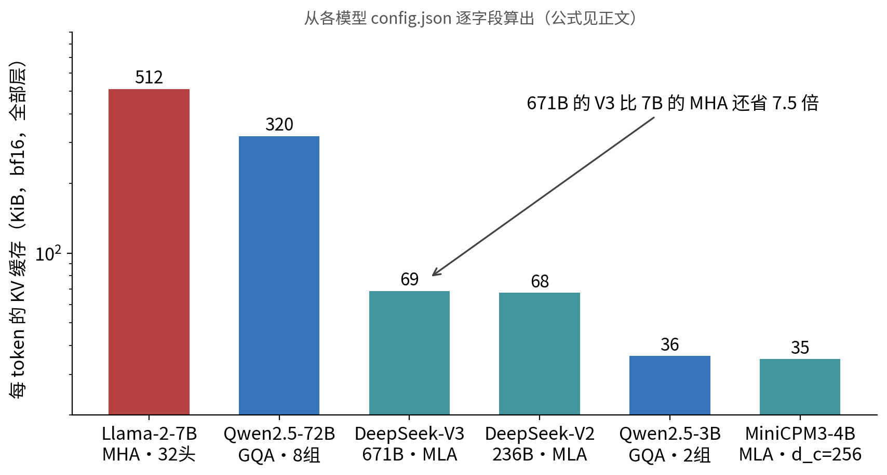
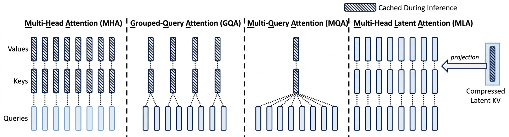
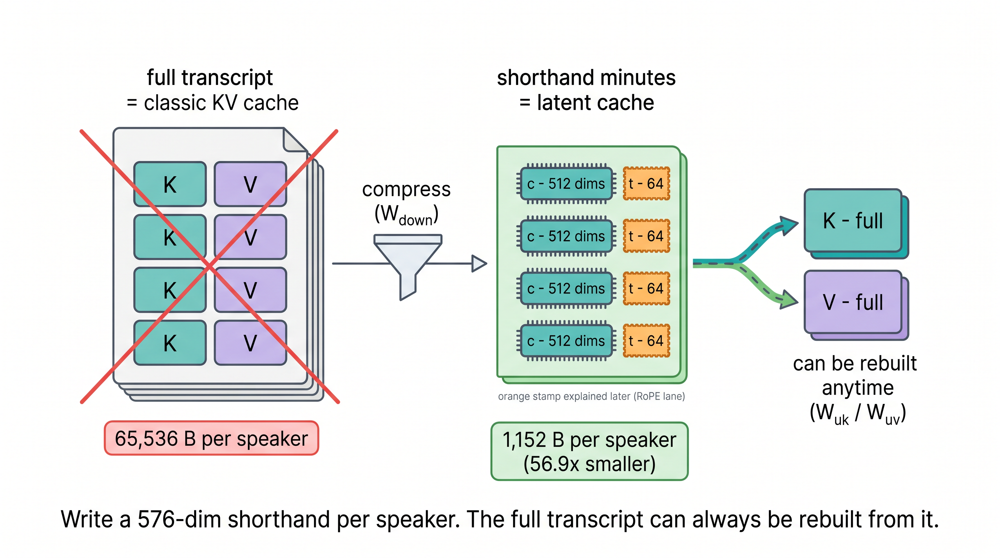
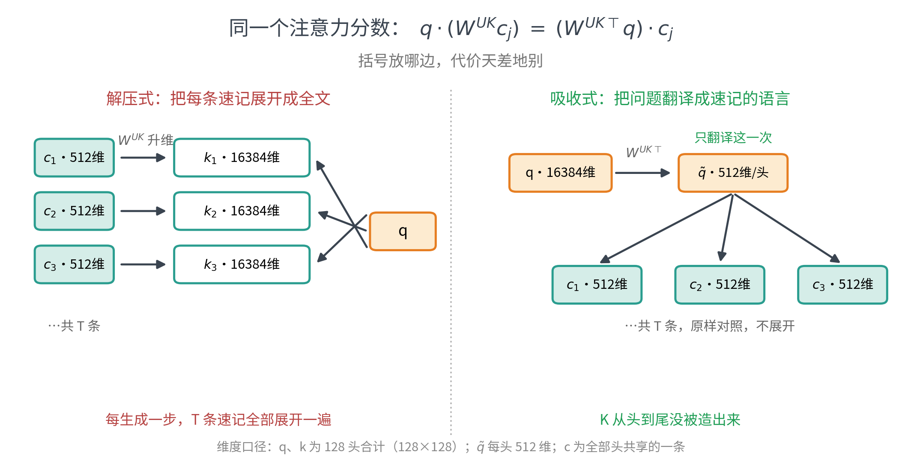
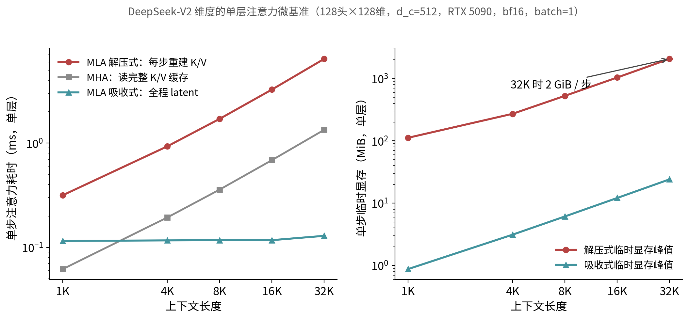
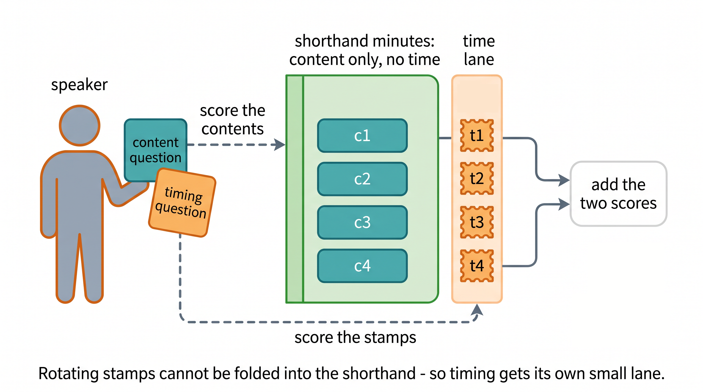

# MLA 详解：DeepSeek 把 KV Cache 压小 57 倍的三步棋

上一篇《LLM 中的 KV Cache》算过一笔账：KV 缓存是长上下文推理的显存无底洞，Qwen2.5-3B 每个 token 要存 36 KiB，一条 32K 请求就是 1.1 GiB。当时留了个尾巴——"从 MQA、GQA 到 DeepSeek 的 MLA，都在'少存点 K/V'和'别掉点'之间找平衡"。这一篇就把其中最激进也最优雅的 MLA（Multi-head Latent Attention）讲透。

先看一个违反直觉的事实：**671B 的 DeepSeek-V3，每个 token 的 KV 缓存只有 68.6 KiB——比 7B 的 Llama-2（MHA，512 KiB）还小 7.5 倍**。模型大了 96 倍，缓存反而不到对方的七分之一。这不是量化魔法，是注意力结构本身被重新设计了。

照例先给 30 秒版本：

> MLA 做了三件事。**第一**，不再缓存每个头的 K 和 V，只缓存一条 512 维的低秩"速记" $c$（就是 MLA 名字里的 latent 向量），内容键和 V 都能从它精确重建（完整的键还差第三件事里的位置旁路）。**第二**，推理时根本不做重建：利用矩阵结合律"换个括号"，把升维矩阵吸收进查询侧，注意力全程在速记空间里做，这就是**矩阵吸收**。**第三**，RoPE 位置编码和吸收天然冲突，解法是让位置信息走一条 64 维的小旁路、与速记并排缓存，这就是**解耦 RoPE**。三步落齐，每 token 只存 512+64=576 维，比同规格 MHA 的缓存小 57 倍；少一步都不成立。

预备知识：知道 KV Cache 是什么、为什么占显存（读过上一篇即可）。文中所有数字都是实测或从官方 config 逐字段算出的，代码可以直接跑。

## 一、账本先行：从 512 KiB 到 35 KiB

先把"省多少"钉死，再讲"怎么省"。每 token 的 KV 缓存字节数只由架构超参决定，从各模型的 `config.json` 逐字段就能算出来：

$$
\text{MHA/GQA: } 2 \times n_{\text{kv\_heads}} \times d_{\text{head}} \times \text{bytes} \times n_{\text{layers}}
\qquad
\text{MLA: } (d_c + d_R) \times \text{bytes} \times n_{\text{layers}}
$$

为公平对比，账本统一按 bf16（2 B/元素）计；生产部署里缓存还可以再量化，那是另一笔账（见第八节）。

| 模型 | 架构 | 每 token 缓存 | 关键超参 |
|---|---|---|---|
| Llama-2-7B | MHA·32 头 | 512 KiB | 32 头都各存一份 K/V |
| Qwen2.5-72B | GQA·8 组 | 320 KiB | 64 个 Q 头共享 8 组 K/V |
| DeepSeek-V3（671B） | MLA | 68.6 KiB | $d_c=512$，$d_R=64$，61 层 |
| DeepSeek-V2（236B） | MLA | 67.5 KiB | $d_c=512$，$d_R=64$，60 层 |
| Qwen2.5-3B | GQA·2 组 | 36 KiB | 16 个 Q 头共享 2 组 K/V |
| MiniCPM3-4B | MLA | 34.9 KiB | $d_c=256$，$d_R=32$，62 层 |



三个观察：

1. **MHA 的账没法看**。每个头一份 K/V，头数随模型变大而变多，缓存跟着爆炸，这正是上一篇结尾说"架构为缓存让路"的原因。
2. **GQA 是在"份数"上做减法**：让若干个 Q 头共享一组 K/V，省的倍数等于分组比。省 8 倍就得 8 个头挤一组，压得越狠，表达越受限；压到极限就是 MQA——全部头共享仅剩的一组。但无论压到几组，它都还在"每组存完整的 $d_{head}$ 维 K 和 V"这个框架里。
3. **MLA 换了个游戏**：它不在"存几份"上讨价还价，而是问——K 和 V 有没有必要以"成品"形态被存下来？

把这条演进路线画在一张图上看得最清楚（阴影部分 = 推理时真正躺在缓存里的东西）：MHA 每头一份完整 K/V，GQA 是几个头拼一份，MQA 压到只剩一份——都是在阴影的**份数**上做文章；只有 MLA 把阴影换成了一条细细的 latent 向量，完整的 K/V 变成虚线——用时投影出来，根本不进缓存。



DeepSeek-V2 的具体数字：128 个头 × 128 维，若按 MHA 缓存是每层每 token $2 \times 128 \times 128 \times 2\,\text{B} = 65536$ B；MLA 只存 $512 + 64 = 576$ 维、1152 B——**56.9 倍**。这个倍数怎么来的，下面三节一步一步拆。

## 二、第一步棋：只记速记，不抄全文

回到上一篇的圆桌会议：每位发言者（token）发言后，把"主题标签 K"和"发言要点 V"写进会议纪要（KV 缓存），后来者拿问题 q 对着纪要逐条打分、加权汇总。会开得越久，纪要越厚——因为每个人都被**全文抄录**了一遍。

MLA 的第一步棋：**别抄全文，记速记**。每位发言者只在纪要里留一行 512 维的速记 $c$；需要标签和要点时，随时能从速记展开出来：

$$
c_j = W^{DKV} h_j \qquad k^C_j = W^{UK} c_j \qquad v_j = W^{UV} c_j
$$

$W^{DKV}$ 把 5120 维的 hidden state 压到 512 维（降维，Down），$W^{UK}$、$W^{UV}$ 负责在需要时升维（Up）恢复出全部 128 个头的 K、V。上标 $C$ 表示"内容部分"——完整的键还要拼上一小截带位置信息的 $k^R$，那是第五节的事，本节暂按下不表。缓存里只躺着 $c$。



为什么敢这么压？两个理由：

- **K 和 V 本来就不是"原始信息"**——它们是同一个 hidden state 乘投影矩阵的产物。128 个头的 K、V 全部派生自同一个 5120 维向量，联合起来的秩本就不超过 5120，天然适合共享一条低秩底稿；K 和 V **联合**压缩（共享一条 $c$）而不是各压各的，正是在利用这层共同来源。但把底稿压到 512 维，是实打实的**容量取舍**——没有定理保证 512 维"刚好够用"，是端到端训练把信息挤进这个瓶颈，再由消融实验验证不掉点（DeepSeek-V2 论文报告 MLA 效果不弱于甚至略优于 MHA）。
- **这不是训练后的近似压缩**。MLA 是训练时就定义好的结构：模型从第一步梯度起就在学"怎么把值得记的信息写进 512 维"。$k^C_j = W^{UK} c_j$ 是定义，不是逼近——相对这套结构自身，重建没有一丝误差。

类比的边界照例划清，这里有两种"不丢东西"别混为一谈：**重建无额外误差**——速记员不会漏记，K、V 从 $c$ 恢复是精确的矩阵乘法（下一节用代码逐位验证）；但**相对一个无约束的 MHA**，512 维瓶颈限制了 K/V 能张成的子空间，这层约束真实存在，只是被训练消化了。另外"速记"也不是训练后从全文压出来的，而是一开始就只写速记，全文反而是从速记展开的衍生品——这一点类比是反着的，请以公式为准。

## 三、第二步棋：换个括号，永不解压

口说无凭。下面这段代码用 DeepSeek-V2 的真实维度（5120 隐层、128 头 × 128 维、$d_c=512$、$d_R=64$）从零实现 MLA 的推理路径，一次验证四件事——前两件是本节的，后两件留给第五节：

```python
"""从零实现 MLA（Multi-head Latent Attention）的推理视角，验证四件事：

A vs B：只缓存 latent、用时解压  ==  缓存完整 K/V（逐位一致）
A vs C：矩阵吸收（不解压、直接在 latent 空间做 attention）==  显式解压
D    ：把 RoPE 夹在中间再天真吸收 → 数值直接不等（这就是为什么需要解耦 RoPE）
E    ：解耦 RoPE（k_R 单独缓存一小截）→ 恢复一致

维度取 DeepSeek-V2 真实值（hidden 5120、128 头 × head_dim 128、d_c=512、d_R=64），
权重随机、fp64、CPU 可跑：python toy_mla.py
"""

import torch

torch.manual_seed(42)
torch.set_default_dtype(torch.float64)

D, H, DH, DC, DR = 5120, 128, 128, 512, 64   # hidden / 头数 / 每头维 / latent 维 / RoPE 维
T = 32                                        # 序列长度

# 权重：降维 W_dkv，升维 W_uk/W_uv（按头拆），查询 W_q，解耦 RoPE 的 W_kr/W_qr
W_dkv = torch.randn(D, DC) / D**0.5
W_uk = torch.randn(H, DC, DH) / DC**0.5
W_uv = torch.randn(H, DC, DH) / DC**0.5
W_q = torch.randn(H, D, DH) / D**0.5
W_kr = torch.randn(D, DR) / D**0.5
W_qr = torch.randn(H, D, DR) / D**0.5

h = torch.randn(T, D)                         # 假装是 T 个 token 的 hidden state
c = h @ W_dkv                                 # latent：每 token 只有 512 维 [T, DC]
q = torch.einsum("td,hde->the", h, W_q)       # [T, H, DH]


def rope(x: torch.Tensor, pos: torch.Tensor) -> torch.Tensor:
    """标准 RoPE：最后一维按两两一组旋转，角度随位置 pos 变化。"""
    half = x.shape[-1] // 2
    freq = 1.0 / (10000 ** (torch.arange(half) / half))
    ang = pos[:, None] * freq[None, :]                      # [T, half]
    cos, sin = ang.cos(), ang.sin()
    while cos.dim() < x.dim():                              # 对齐 [T, ..., half]
        cos, sin = cos.unsqueeze(1), sin.unsqueeze(1)
    x1, x2 = x[..., :half], x[..., half:]
    return torch.cat([x1 * cos - x2 * sin, x1 * sin + x2 * cos], dim=-1)


def attn(scores: torch.Tensor, v: torch.Tensor) -> torch.Tensor:
    """给定打分 [H, T]（最新 token 对全部位置）和 V [T, H, DH]，返回各头输出。"""
    w = (scores / (DH + DR) ** 0.5).softmax(-1)
    return torch.einsum("ht,the->he", w, v)


pos = torch.arange(T)
diff = lambda a, b: float((a - b).abs().max())

# ---- 路径 A：显式缓存完整 K/V（不含 RoPE，先看纯低秩部分）----
K = torch.einsum("tc,hce->the", c, W_uk)      # 解压出每头的 K [T, H, DH]
V = torch.einsum("tc,hce->the", c, W_uv)
score_A = torch.einsum("he,the->ht", q[-1], K)
out_A = attn(score_A, V)                      # 最新 token 的各头输出 [H, DH]

# ---- 路径 B：只缓存 c，用时解压（与 A 是同一段数学）----
K_b = torch.einsum("tc,hce->the", c, W_uk)
score_B = torch.einsum("he,the->ht", q[-1], K_b)
out_B = attn(score_B, torch.einsum("tc,hce->the", c, W_uv))
print(f"A(缓存完整K/V) vs B(缓存latent+解压): 最大差值 {diff(out_A, out_B):.1e}")

# ---- 路径 C：矩阵吸收——把 W_uk 吸进 q，attention 直接在 512 维 latent 上做 ----
q_tilde = torch.einsum("he,hce->hc", q[-1], W_uk)   # 吸收后的查询 [H, DC]
score_C = torch.einsum("hc,tc->ht", q_tilde, c)     # 打分只用 c，不解压 K
w_C = (score_C / (DH + DR) ** 0.5).softmax(-1)
u = torch.einsum("ht,tc->hc", w_C, c)               # 加权 latent [H, DC]
out_C = torch.einsum("hc,hce->he", u, W_uv)         # 最后才升维（可再吸进 W_O）
print(f"A(显式解压)     vs C(矩阵吸收):      最大差值 {diff(out_A, out_C):.1e}")

# ---- D：天真吸收 + RoPE：把 RoPE 加在解压后的 K 上，再假装还能吸收 ----
K_rope = rope(K, pos)                                # 正确做法：旋转作用在每头 K 上
score_true = torch.einsum("he,the->ht", rope(q, pos)[-1], K_rope)
c_rope = rope(c, pos)                                # 天真做法：把旋转挪到 latent 上
score_naive = torch.einsum("hc,tc->ht", torch.einsum("he,hce->hc", rope(q, pos)[-1], W_uk), c_rope)
print(f"D 天真吸收+RoPE vs 真值:            最大差值 {diff(score_true, score_naive):.1e}  <- 翻车")

# ---- E：解耦 RoPE——位置信息走单独的小通道 k_R（64 维，所有头共享），与 c 并排缓存 ----
k_r = rope(h @ W_kr, pos)                            # [T, DR]，这一截才带位置
q_r = rope(torch.einsum("td,hde->the", h, W_qr), pos)[-1]   # [H, DR]
score_E = score_C + torch.einsum("he,te->ht", q_r, k_r)     # 内容分 + 位置分
out_E = torch.einsum("hc,hce->he", torch.einsum("ht,tc->hc",
        (score_E / (DH + DR) ** 0.5).softmax(-1), c), W_uv)
# 对照：同一解耦结构、但显式解压 K/V 的算法
score_ref = torch.einsum("he,the->ht", q[-1], K) + torch.einsum("he,te->ht", q_r, k_r)
out_ref = attn(score_ref, V)
print(f"E 解耦RoPE吸收  vs 显式解压对照:     最大差值 {diff(out_E, out_ref):.1e}")

# ---- 缓存账本（每 token 每层，bf16 2 字节）----
mha, mla = 2 * H * DH * 2, (DC + DR) * 2
print(f"每 token 每层缓存: MHA {mha} B | MLA {mla} B -> {mha / mla:.1f}x 压缩")
```

输出：

```
A(缓存完整K/V) vs B(缓存latent+解压): 最大差值 0.0e+00
A(显式解压)     vs C(矩阵吸收):      最大差值 2.2e-15
D 天真吸收+RoPE vs 真值:            最大差值 5.2e+01  <- 翻车
E 解耦RoPE吸收  vs 显式解压对照:     最大差值 2.9e-15
每 token 每层缓存: MHA 65536 B | MLA 1152 B -> 56.9x 压缩
```

第一行就是第二节的承诺：**缓存速记再解压，与缓存完整 K/V 逐位一致（差值严格为 0）**——同一段数学，只是存的东西不同。

第二行是 MLA 真正的灵魂，也是第二步棋。注意路径 C 里 `K` 这个变量根本没出现——注意力打分直接在 512 维的 $c$ 上做完了，与显式解压的差值 2.2e-15 是 fp64 的浮点噪声。它靠的是一个不起眼的恒等式：

$$
\underbrace{q^{\top}(W^{UK} c_j)}_{\text{解压式：先重建 } k_j} \;=\; \underbrace{(W^{UK\top} q)^{\top} c_j}_{\text{吸收式：先翻译 } q}
$$

矩阵乘法结合律，仅此而已。但括号放哪边，代价天差地别：



- **左边（解压式）**：每生成一个 token，都要把全部 $T$ 条速记升维成 16384 维的 K（128 头 × 128 维），再和 q 打分——重建量随上下文线性增长；
- **右边（吸收式）**：把 q **翻译**成速记的语言（$\tilde{q} = W^{UK\top} q$，每步只做一次，与上下文长度无关），然后拿 $\tilde{q}$ 直接对每条 512 维速记打分。K 从头到尾没被造出来。

V 侧同理：先在速记空间用注意力权重对各条速记加权求和（得到 512 维的 $u$），最后才升维一次（工程实现里 $W^{UV}$ 还可以进一步吸进输出投影 $W^O$）。用会议类比说：**不是把每条速记展开成全文再读，而是把你的问题翻译成速记的语言，直接对着速记本读**。

## 四、免费午餐吗？实测告诉你括号的价钱

"解压式"和"吸收式"数学等价，工程上却是两个世界。用 DeepSeek-V2 的真实维度搭一个单层注意力微基准（权重随机不影响耗时与显存的结论——计算图与真实模型同形），单步解码、逐个上下文长度实测：



| ctx | MHA | MLA 解压式 | MLA 吸收式 |
|---|---|---|---|
| 4K | 0.19 ms | 0.93 ms（临时 272 MiB） | **0.12 ms**（3.1 MiB） |
| 32K | 1.34 ms | 6.43 ms（临时 2072 MiB） | **0.13 ms**（24.1 MiB） |

三个结论，一个比一个有意思：

1. **解压式是"省了缓存、费了时间、还赔上临时显存"**：每步要凭空造出 [T, 128, 128] 的 K 和 V，32K 上下文时单层单步就要 2 GiB 临时显存、6.4 ms——缓存省下的显存被临时张量吃回去了。天真实现的 MLA 是负优化。
2. **吸收式在实测区间内近似持平**：1K→32K 只从 0.12 涨到 0.13 ms。注意这不是渐近性质——它每步仍要对 $T \times 576$ 的速记打分聚合，理论工作量随 $T$ 线性涨，只是在这个区间里，这点读取量还压不过固定开销（含那次与 $T$ 无关的"翻译"）。上下文再拉长，它终会随 $T$ 线性爬升，只是斜率比谁都缓。
3. **吸收式比 MHA 还快 10 倍（32K 时，本实现在这张卡上的实测）**。主因是上一篇讲过的老朋友：decode 是 memory-bound 的，单步耗时大头是从显存搬缓存——MLA 的缓存**体积**小 57 倍，显著压低了长上下文 decode 的主导 KV 流量。但体积比不等于流量比，更不等于加速比：实际 DRAM 读取还取决于算子融合、片上复用与 kernel 实现，这份显著的流量折扣在本实现、这张卡上兑现成了 10 倍的时间折扣。**缓存压缩在 memory-bound 的世界里，同时就是提速**——这是 MLA 从 V2 一路用到 V3 的底气。

（照例交代口径：单层、batch=1、bf16、RTX 5090，中位数计时含 CUDA 同步；真实模型还有 MoE/FFN 等其他开销，这里只对比注意力这一段；MHA 基线未加 RoPE 项，对比口径对 MLA 一侧略偏严。）

## 五、第三步棋：RoPE 不肯配合，那就给它修条小路

到这里似乎大功告成——直到 RoPE 进场。上面 toy 代码的第三行输出就是事故现场：

```
D 天真吸收+RoPE vs 真值:            最大差值 5.2e+01  <- 翻车
```

RoPE 给每个位置的 q、k 施加一个**随位置变化的旋转** $R_j$。正确的打分是 $\left(R_i q\right)^{\top} R_j (W^{UK} c_j)$——旋转作用在**升维之后**的 k 上。这与吸收的冲突有两层：

- **吸收的前提是"翻译一次、处处可用"**：$\tilde{q}$ 必须与键的位置 $j$ 无关，才能一次算好、拿去对每条速记打分。RoPE 一来，打分里出现随 $j$ 变化的 $R_j$，"一次翻译"在结构上就不成立了。
- **想把旋转搬进速记空间也不行**：128 个头共享同一条 $c$，却各有不同的 $W^{UK}_h$——一般不存在一个对所有头同时"等变"的共享 latent 变换能替代逐头的 $R_j$，架构上也没有施加这种约束（旋转作用在 128 维的头空间、$c$ 活在 512 维共享空间，维度错位只是这层障碍的直观提示）。硬要绕只剩三条路：每步按需重建旋转后的 K（即第四节实测过的解压式——缓存是小了，时间和临时显存赔进去）、干脆缓存重建后的 K（丢掉 MLA 的主要缓存优势）、或按位置按头存变换结果（比不吸收还贵）。

上面 toy 实验证明的是其中可实验的那一步：把标准 RoPE 天真地挪到 $c$ 上再吸收，分数直接差出 52——不是精度问题，是这条捷径在数学上不存在。**低秩压缩想要"位置无关的速记"，RoPE 偏偏要"位置相关的标签"**，两者结构性冲突。

DeepSeek 的解法不纠结，直接绕路——**解耦 RoPE（decoupled RoPE）**：

- 速记 $c$ 保持纯净，**不带任何位置信息**，内容打分走吸收路径（第三节的路径 C）；
- 另外从 hidden state 引出一条**64 维的小通道** $k^R_j$（全部 128 个头共享一条），RoPE 只施加在这条小通道上，与速记并排缓存；
- 每步打分 = 内容分 + 位置分：$\tilde{q}^{\top} c_j + (q^R)^{\top} k^R_j$，然后照常 softmax。



toy 代码的第四行输出验证了这条路：解耦后吸收路径与显式对照差值 2.9e-15，恢复等价。代价写进账本：缓存从 512 维变成 $512 + 64 = 576$ 维，多付 12.5%，换回吸收的全部收益；账本公式里的 $d_R$ 就是这么来的。

用会议类比收个尾：速记本里只记"说了什么"，不记"什么时候说的"；时间戳单独一小栏。新发言者的问题也拆成两半——内容问题拿去对速记，时间问题拿去对时间戳，两路分数相加。**边界声明**：真实的 RoPE 不是字面的"时间戳"，它是把相对位置编码进内积的旋转变换；"小栏"也不是补丁，$q^R$ 这一路在训练中与主路联合学习，两路分数除以同一个 $\sqrt{d_h + d_R}$ 再做 softmax。

## 六、真机对账：一个措手不及的活案例

理论与微基准都齐了，最后上完整模型。同一张 RTX 5090，两个体量相近、架构不同的模型：MiniCPM3-4B（少数开源的 MLA 模型，$d_c=256$、$d_R=32$、62 层，架构公式值 34.9 KiB/token）和 Qwen2.5-3B（GQA·2 组，公式值 36 KiB/token）。显存差值法测缓存、逐位对公式——然后测出了一个比"确认公式"有意思得多的东西：

| 模型 | prefill 长度 | 实测缓存占用 | 实测每 token | 公式每 token | 单步 decode |
|---|---|---|---|---|---|
| Qwen2.5-3B | 1K / 4K / 8K / 16K | 36 → 576 MiB | 36 864 B（**+0.0%**） | 36 864 B | ~14.8 ms |
| MiniCPM3-4B | 1K / 4K / 8K | 1085 → 8680 MiB | 1 111 040 B（**+3011%**） | 35 712 B | 40 ~ 55 ms |
| MiniCPM3-4B | 16K | **OOM**（32 GB 卡爆显存） | — | — | — |

Qwen 一侧完全复现了上一篇的结果：实测与公式逐字节相等。MiniCPM3 一侧，缓存占用是 MLA 公式值的 **31 倍**，decode 比小它一圈的 Qwen 慢 3 倍，16K 上下文直接把 32 GB 显存打爆——**一个号称缓存最省的架构，跑出了全场最差的缓存成绩**。

不是 MLA 骗人，是实现没兑现，而且亏了两层。翻开它的 `modeling_minicpm.py`（与 DeepSeek-V2 的开源参考实现同源）逐层对账：

- **第一层亏**：每次前向先用 `kv_b_proj` 把速记**解压成全部 40 个头的 K 和 V，然后把解压结果整个塞进缓存**。缓存张量本体是每 token 每层 K 96 维、V 64 维 × 40 头，共 793 600 B/token——公式值的 **22.2 倍**。这正是第四节警告过的"解压式"路线，还更亏：微基准好歹只缓存速记、每步重建，参考实现干脆把解压结果当缓存存了。
- **第二层亏**：实测占用 1 111 040 B/token，比缓存本体还多 317 440 B。取证（`e2b_cache_introspect.py`）显示：V 缓存的是 `kv_b_proj` 输出（每头 128 维）的**非连续切片视图**，PyTorch 的视图会把整块母张量钉在显存里——每 token 又白押了 40 头 × 64 维的死空间。经典脚枪，在"按 token 累积、永不释放"的 KV 缓存上被放大到了 31 倍。

这个"翻车"是有普遍性的教学案例：**架构给的是上限，实现决定兑现多少**。HF 的 trust_remote_code 参考实现以正确性和可读性优先，本就没打算做吸收；生产级推理引擎（vLLM、SGLang，以及 DeepSeek 自家的 FlashMLA kernel）实现的才是第三节的吸收式路径，那 57 倍才真正到手。读论文看到的压缩比，和你 `from_pretrained` 跑出来的显存占用，中间隔着一整层推理工程。（口径备注：缓存占用为差值法所测、每长度测两遍取第二遍以排除一次性缓冲，且与直接枚举缓存对象母张量的字节数逐位吻合；两个模型分别跑在 transformers 5.14 / 4.46 上——后者是 MiniCPM3 自定义代码的兼容性要求，影响 decode 延迟的常数项，不影响缓存字节数。）

顺带补一个诚实的观察：即使实现完美兑现，**在 4B 这个体量 MLA（34.9 KiB）对 GQA-2（36 KiB）也只是打平**。MLA 的压缩倍数是相对"头很多的 MHA"算的——DeepSeek-V2/V3 有 128 个头，MHA 账本大得吓人，MLA 才显得惊艳；小模型头本来就少，GQA 压到 2 组也没剩多少。**MLA 的主场是大模型**：头数上去之后，GQA 要么多留几组（缓存涨）要么硬压（掉点），MLA 的速记维度 $d_c$ 不必随头数线性增长。这也是为什么它出现在 236B 和 671B 上。

## 七、代价清单：MLA 不是免费的

按本系列的惯例，把不那么好听的也列全：

- **它是训练时的结构决定，不能事后贴上去**。已经训好的 GQA 模型不能直接改成 MLA 白拿 57 倍——好在有后续工作（如 TransMLA）研究把 GQA 检查点改造成 MLA 再继续训练。
- **矩阵吸收改变了计算结构**：吸收式的打分是 $H \times T \times d_c$ 的矩阵乘（512 维内积），比 MHA 的 128 维内积单位计算量更大——只是在 memory-bound 的 decode 下，省下的显存读取远比多出的 FLOPs 值钱；在 compute-bound 的 prefill/训练侧，MLA 同样需要专门的算子优化才能吃满硬件；DeepSeek 开源的 FlashMLA 则是生产级 MLA **解码** kernel 的代表。
- **效果不是"无损"三个字能概括的**：约束 K/V 活在 512 维子空间当然是容量限制，DeepSeek-V2 论文的消融实验显示，MLA 在同规模下优于 MHA——原因之一是省下的缓存预算换来了更多的头数与维度自由度。这是论文数字，非本文实测，边界如实声明。
- **q 侧其实也压了**（$d_{c}'=1536$ 的低秩 q，主要为省训练激活显存），本文的 toy 为聚焦省略了这一路——它不影响 KV 缓存账本。

## 八、再往前走一步

- **FlashMLA**：DeepSeek 开源的 MLA 专用注意力 kernel，把吸收式路径在 Hopper GPU 上打满带宽。
- **TransMLA**：把训好的 GQA 模型改造成 MLA 的迁移方案，证明"速记"可以后天学。
- **KV 量化与卸载**：与 MLA 正交的另一维度——速记本身还能再量化（V3 实践中缓存以低精度存储）。
- **和上一篇连起来读**：PagedAttention 管缓存的"住"，prefix caching 管缓存的"复用"，MLA 管缓存的"体积"——现代推理栈在这三个维度上同时施工。

## tl;dr

1. KV 缓存大小由架构决定：MHA 按头数线性爆炸，GQA 在"存几份"上打折，MLA 改存 512 维低秩速记 $c$ 加 64 维位置旁路（共 576 维）——相对 128 头的 MHA 压 56.9 倍，671B 的 V3 每 token 只要 68.6 KiB。
2. 重建无额外误差：内容键 $k^C$ 与 V 从 $c$ 恢复是精确定义（完整键另含 $k^R$ 旁路），toy 实验逐位一致（差值 0）；但 512 维瓶颈相对无约束 MHA 是真实的容量取舍，由端到端训练消化、消融验证。
3. 推理时不解压：矩阵结合律把 $W^{UK}$ 吸进查询侧，注意力全程在速记空间做，与解压式差值 2e-15；实测吸收式单步 0.13 ms、在 1K–32K 区间近似持平（理论上仍随长度线性），32K 时比 MHA 快 10 倍（本实现实测）——主因是 decode 为 memory-bound，缓存小、搬得少。
4. 解压式是陷阱：每步重建 K/V，32K 单层单步 2 GB 临时显存、6.4 ms，负优化。
5. RoPE 的位置依赖破坏"查询只翻译一次"的吸收前提，多头共享 $c$ 时一般也没有统一的 latent 侧旋转（toy 实验：天真挪动旋转，差值 52）；解耦 RoPE 让位置信息走 64 维旁路，多付 12.5% 缓存恢复等价。
6. MLA 的主场是多头大模型；4B 体量上它与 GQA-2 打平（34.9 vs 36 KiB）。它是训练时的结构选择，配合 FlashMLA 这类 kernel 才能全效发挥。
7. 架构给上限，实现定兑现：MiniCPM3 的 HF 参考实现把解压后的全部头 K/V 直接缓存（22.2 倍），V 还是切片视图、钉住母张量再多押三成（合计 31 倍、每 token 1085 KiB），16K 即 OOM——MLA 的收益要靠吸收式实现（vLLM/SGLang/FlashMLA）才真正落地，这是全文最贵的一条实测教训。

## 实验环境与复现

- 硬件：NVIDIA GeForce RTX 5090（32 GB）
- 软件：PyTorch 2.12.1+cu130；transformers 5.14.1（Qwen2.5-3B）/ 4.46.3（MiniCPM3-4B，其 trust_remote_code 代码与 v5 不兼容）
- 本目录结构：`正文.md` + `code/`（toy_mla.py 即文中代码正本；绘图脚本）+ `experiments/`（e2 真机对账、e3 config 账本、e4 微基准；results/ 存原始 JSON）+ `figures/`
- 特别声明：全文**没有加载过 DeepSeek-V2/V3 的权重**（236B/671B 装不进单卡）。凡涉及 V2 的实验均为"结构复现"——只取其架构维度、权重随机：所验证的恒等式与所测的耗时/显存只取决于计算结构，不取决于权重数值。真正加载过的完整模型只有 MiniCPM3-4B 与 Qwen2.5-3B。
- toy 实验 fp64/CPU；微基准与真机测量在服务器进行，计时含 CUDA 同步取中位数，显存用 `torch.cuda.memory_allocated()` 差值法（先暖机再测，避免一次性缓冲混入）
- 复现：`python code/toy_mla.py`（本地）；`experiments/` 下脚本在 GPU 服务器上按文件头说明运行

## 延伸阅读

- **MLA 原始出处**：DeepSeek-AI. *DeepSeek-V2: A Strong, Economical, and Efficient Mixture-of-Experts Language Model*. arXiv:2405.04434, 2024. — MLA 的定义、消融与 93.3% 缓存缩减的官方口径（其对比基线为 DeepSeek 67B）。
- **规模化验证**：DeepSeek-AI. *DeepSeek-V3 Technical Report*. arXiv:2412.19437, 2024. — 671B 上继续沿用 MLA 的工程实践。
- **小模型上的 MLA**：MiniCPM3-4B 模型卡（Hugging Face `openbmb/MiniCPM3-4B`）；系列方法见 Shengding Hu et al. *MiniCPM: Unveiling the Potential of Small Language Models with Scalable Training Strategies*. arXiv:2404.06395, 2024.
- **把 GQA 改造成 MLA**：*TransMLA: Multi-Head Latent Attention Is All You Need*. arXiv:2502.07864（NeurIPS 2025 Spotlight，代码 `MuLabPKU/TransMLA`）——证明 GQA 总能等价表示为 MLA，反之不成立。
- **生产级吸收式 kernel**：DeepSeek 开源的 FlashMLA（GitHub `deepseek-ai/FlashMLA`）——Hopper GPU 上的 MLA 解码 kernel，自带 paged KV cache。
- **前作**：《LLM 中的 KV Cache》——本文的账本公式、memory-bound 分析与圆桌会议类比都在那里展开。
